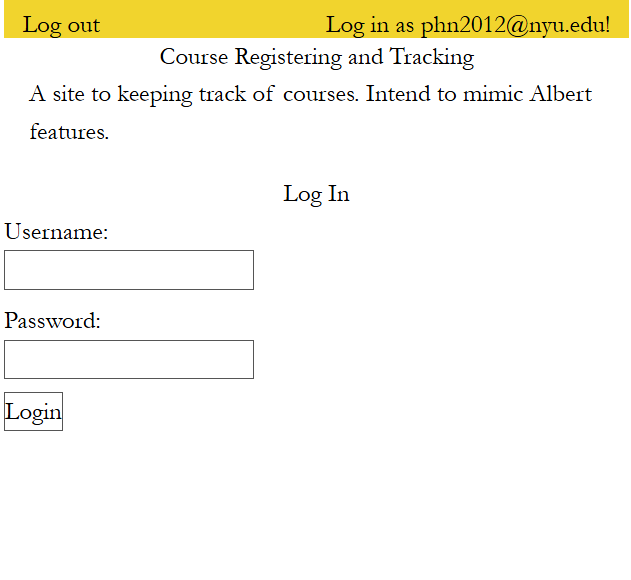
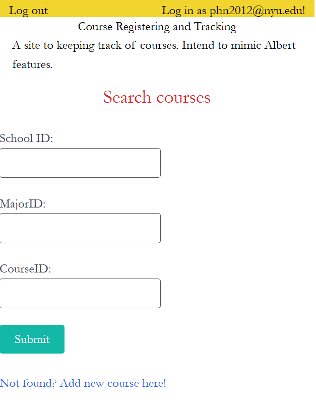
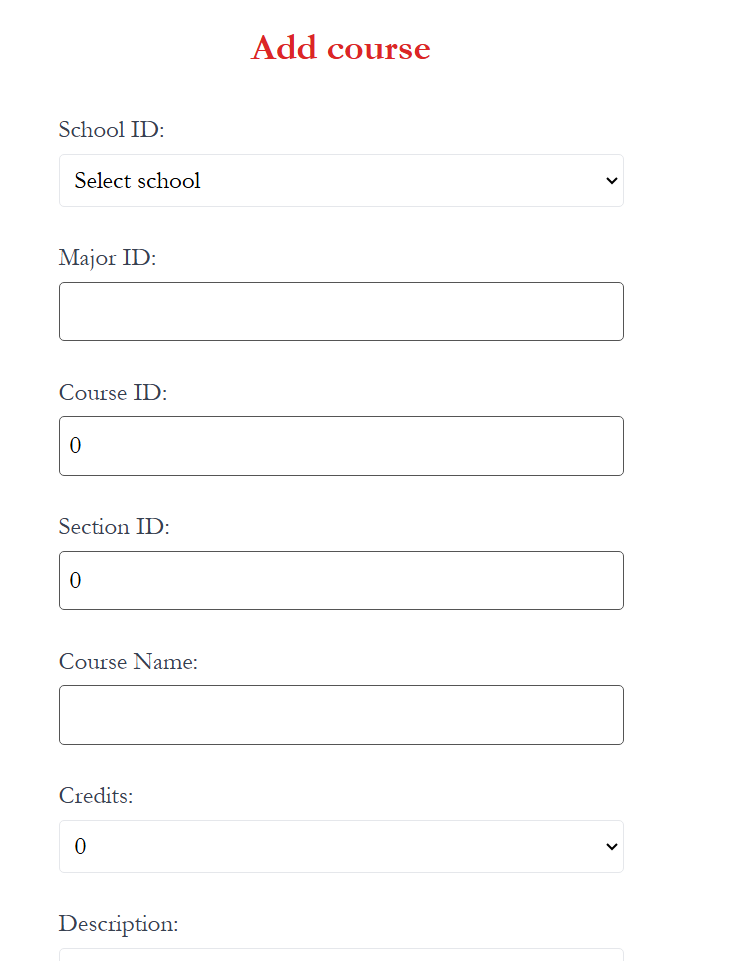

Milestone 04 - Final Project Documentation
===

NetID
---
phn2012

Name
---
Phuc Nguyen

Repository Link
---
(https://github.com/nyu-csci-ua-0467-001-002-fall-2024/final-project-PhucNguyen-rsc)

URL for deployed site 
---
http://linserv1.cims.nyu.edu:33929

URL for form 1 (from previous milestone) 
---
Sign In / Registration Form

Special Instructions for Form 1
---
You have to register before hand. You can leave the email blank while registering. The username + password each must be longer than 8 characters.

URL for form 2 (for current milestone)
---
Search for course to add to user's course list

Special Instructions for Form 2
---
Example: CSCI-UA 470 Object Oriented Programming
CSCI --> MajorID
470 --> CourseID

For schoolID: check the list below:

const schoolDictionary = { 
    1: "Tandon School of Engineering",
    2: "Stern School of Business",
    3: "College of Arts and Science",
    4: "Gallatin School of Individualized Study",
    5: "Graduate School of Arts and Science",
    6: "College of Dentistry",
    7: "Rory Meyers College of Nursing",
    8: "Steinhardt School of Culture, Education, and Human Development",
    9: "School of Law",
    10: "School of Professional Studies",
    11: "NYU Abu Dhabi",
    12: "NYU Shanghai"
}

URL for form 3 (from previous milestone) 
---
Add the new course to the list. 

Special Instructions for Form 3
---
Notice that all the field are required to fill in and must contain valid enterings.
Example: CSCI-UA 470 Object Oriented Programming taught in College of Arts and Science
CSCI --> MajorID
470 --> CourseID
Object Oriented Programming --> class's name
College of Arts and Science --> select in the valid field

First link to github line number(s) for constructor, HOF, etc.
---
/client/Course.jsx line 107

Second link to github line number(s) for constructor, HOF, etc.
---
/client/Course.jsx line 392

Short description for links above
They are all hof functions to send request to URL in Backend API

Link to github line number(s) for schemas (db.js or models folder)
---
/server/src/db.mjs

Description of research topics above with points
---
Applied Vite - 3 pts
Applied React - 6 pts
Applied Tailwind CSS - 2 points
Applied Vercel 

Links to github line number(s) for research topics described above (one link per line)
---
The whole /client folder is React + Tailwind css + Vite based

Attributions
---
Authentication code is based on HW07. 